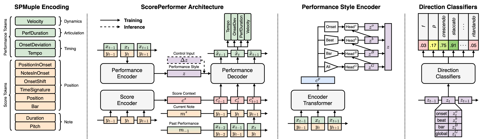
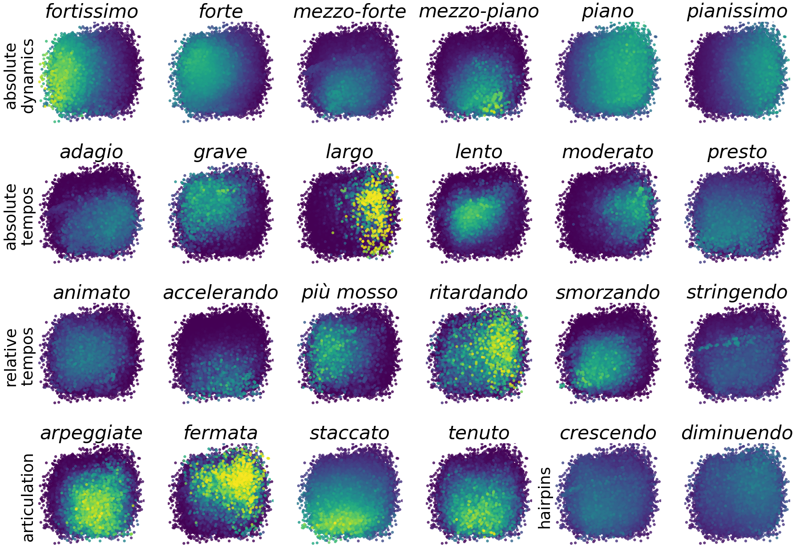

# ScorePerformer: Expressive Piano Performance Rendering Model



> Code for the paper [*"ScorePerformer: Expressive Piano Performance Rendering with Fine-Grained
Control"*](https://archives.ismir.net/ismir2023/paper/000069.pdf) published in the Proceedings of the
> [24th International Society for Music Information Retrieval (ISMIR) Conference, Milan, 2023](https://ismir2023.ismir.net).
>
>Authors: Ilya Borovik and Vladimir Viro
>
>[](https://archives.ismir.net/ismir2023/paper/000069.pdf)
[](http://ismir2023program.ismir.net/poster_183.html)
[](https://colab.research.google.com/drive/1uKEX02D8cn3wzG-oS7YWE3IW-OrGV22w)

## Description

The paper presents ScorePerformer, a controllable piano performance rendering model that:

1. learns fine-grained performance style features at the global, bar, beat, and onset levels using transformers and
   hierarchical maximum mean discrepancy variational autoencoders;
2. provides musical language-driven control over the learned style space through a set of trained performance direction
   classifiers;
3. utilizes a tokenized encoding for aligned score and performance music (SPMuple) with a smooth local window tempo
   function.

The repository provides the code for the model and tokenizers, along with the training and inference pipelines. The
trained model is available to interact with in a simple [Colab demo](https://colab.research.google.com/drive/1uKEX02D8cn3wzG-oS7YWE3IW-OrGV22w).

*Note*: The code for the alignment and preprocessing of score and performance data is deliberately not made available. 
It can be discussed and released upon request and demand.

If you have any questions or requests, please write to ilya.borovik@skoltech.ru

## Latent Style Space Control

Our approach to make the expressive performance rendering controllable relies on the use of performance direction
markings available in musical scores. We use a two-step approach:

1. learn performance style features relevant to performance rendering using a performance style encoder;
2. train performance direction classifiers on the learned style embeddings and ”label” the style space using their predictions.

Below is a vizualization of the top two principal components of the learned latent style spaces, labelled by a subset of
the trained performance direction classifiers.



## Citing

If you use or reference the model, please cite the following paper:

```
@inproceedings{bovorik2023scoreperformer,
  title={{ScorePerformer: Expressive Piano Performance Rendering with Fine-Grained Control}},
  author={Borovik, Ilya and Viro, Vladimir},
  booktitle={Proceedings of the 24th International Society for Music Information Retrieval Conference {(ISMIR)}},
  year={2023},
  url={https://archives.ismir.net/ismir2023/paper/000069.pdf},
}
```

## License

The work is released under a [CC BY-NC-SA 4.0 license](https://creativecommons.org/licenses/by-nc-sa/4.0/).